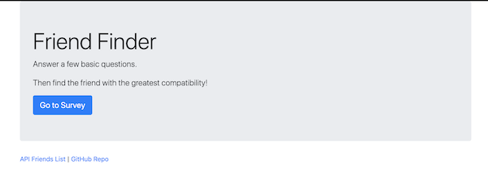
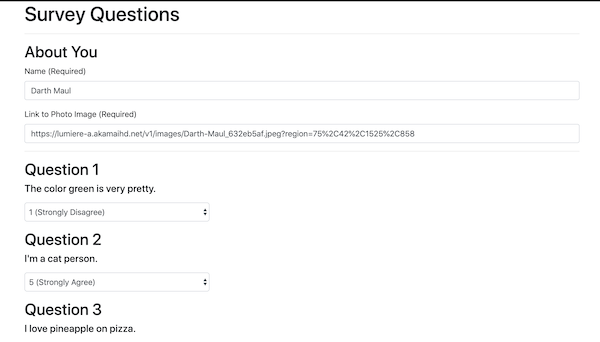
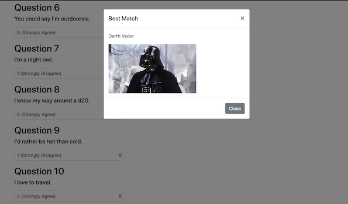

# FriendFinder
A friend compatibility app made as an exercise for learning Node.js and Express

## App Organization
This app is made of files that can be grouped into four categories.

1. server.js: This file is our server and the linchpin holding everything together.

2. Data: These include friends.js and friendshipCalc.js, files where data is stored and processed.

3. Public: These are the html files we serve the user.

4. Routing: These files handle the incoming requests from the user and serve them the appropriate files.

## How to Find a Friend

1. Visit https://gentle-woodland-03458.herokuapp.com/

2. Hit "Go to Survey"

3. Enter your name, provide a link to a photo, and answer 10 questions as honestly as possible.

4. Submit your answers and you'll learn you your perfect friend is.*

5. Interested in checking out all the friend info we've gathered so far. Click the "API Friends List" at the bottom of the page. Or click "GitHub Repo" to visit the GitHub Repo page for this project.

## Tech Used

This app is built using Node.js and Express.js. I also used Bootstrap to help with front-end layout.

## About Me

I'm a full stack web developer. Thanks for stopping by!

*Note: There's no guarantee that the result will be your perfect friend. This quiz is highly unscientific. It's a coding exercise.